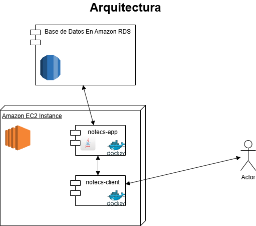

# Notecs App 

Aplicacion web para crear y gestionar tareas para la prueba Tecnica de Consystec. Esta app usa Angular 19 en el frontend y Spring Boot 3 con Gradle 8.5 y Java 21 en el backend.
Utiliza Amazon RDS para la base de datos, docker para gestionar las aplicaciones y una instancia EC2 para tener los containers de las dos apps.
---

## Ariquitectura

---

## Tecnologías utilizadas

- Angular 19
- Node.js 22.1.4
- Spring Boot 3
- Gradle 8.5
- Java 21
- MySQL
- Amazon RDS
- EC2
- Docker

